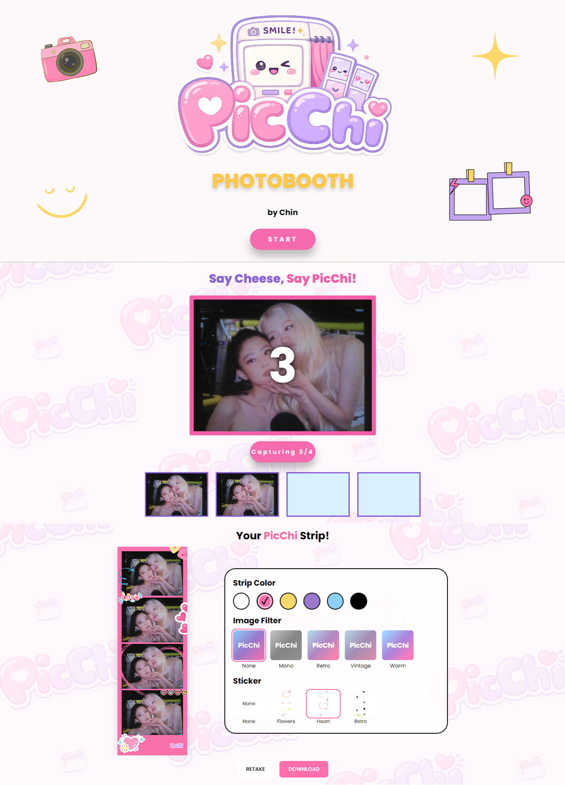

# 📸 PicChi Photobooth

> A modern, interactive web-based photobooth experience designed for capturing, customizing, and downloading memorable moments.

<p align="center">
  
</p>

<p align="center">
  <strong>Capture. Create. Keep the moment.</strong>
</p>

<p align="center">
  <a href="https://picchi-photobooth.vercel.app/">
    
  </a>
</p>

---

## 🌐 Live Demo

**Try PicChi Photobooth:**
https://picchi-photobooth.vercel.app/

---

## 📖 About the Project

**PicChi Photobooth** is a web-based photobooth application created to provide a fun and interactive way to take photos, customize photo strips, and create memorable digital keepsakes.

The project focuses on combining a simple user experience with a visually engaging interface while demonstrating modern front-end development practices.

It was developed as a hands-on project to explore interactive web applications, camera functionality, UI design, responsive layouts, and deployment.

---

## ✨ Features

* 📷 **Camera Capture**
  Capture photos directly through the browser.

* 🎞️ **Photo Strip Creation**
  Arrange captured photos into a photobooth-style layout.

* 🎨 **Photo Customization**
  Customize the appearance and presentation of captured photos.

* 💾 **Photo Download**
  Save the finished photobooth output as an image.

* 📱 **Responsive Design**
  Designed to work across different screen sizes and devices.


---

## 🖼️ Preview

<p align="center">
  
</p>


---

## 🛠️ Tech Stack

| Technology     | Purpose                              |
| -------------- | ------------------------------------ |
| **React.js**   | Front-end development                |
| **JavaScript** | Application logic and interactivity  |
| **HTML5**      | Application structure                |
| **CSS3**       | Styling and responsive design        |
| **Bootstrap**  | UI components and responsive layouts |
| **Vite**       | Development and build tool           |
| **Vercel**     | Deployment                           |

---


## 🚀 Getting Started

### 1. Clone the repository

```bash
git clone <your-repository-url>
```

### 2. Navigate to the project

```bash
cd picchi-photobooth
```

### 3. Install dependencies

```bash
npm install
```

### 4. Start the development server

```bash
npm run dev
```

The application should then be available at the local development URL provided by Vite.

---

## 📸 How It Works

### 1. Start the Photobooth

Open PicChi and begin a new photobooth session.

### 2. Capture Photos

Allow camera access and capture your photos using the photobooth interface.

### 3. Customize

Arrange and customize your photos according to the available options.

### 4. Generate Your Photo

PicChi creates the final photobooth output from your captured photos.

### 5. Download

Download and keep your finished photobooth photo.

---


## 📚 What I Learned

Through developing PicChi, I gained practical experience in building an interactive web application from development to deployment.

Key areas of learning included:

* Building reusable React components
* Managing application state
* Handling user interactions
* Designing responsive interfaces
* Managing Git branches and pull requests
* Deploying a React application with Vercel
* Improving the overall user experience of a web application

---

## 🔮 Future Improvements

Potential improvements for future versions include:

* [ ] More photo strip templates
* [ ] Additional filters and effects
* [ ] More customization options
* [ ] Improved mobile camera experience
* [ ] QR code sharing
* [ ] Event-specific customization

---

## 👩‍💻 Developer

**Francine Louisse C. Miranda**

